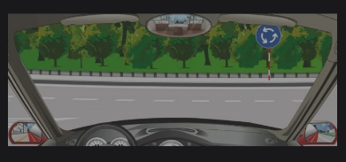

# 科目4错题

## 超速行驶的危害

多选：加重事故后果，视野变窄，制动距离延长（因为刹车刹不住），反应距离延长（因为快一下车就过去了）

## 侧滑

后轮侧滑 -> 同方向转方向盘，后轮是动力输出的

前轮侧滑 -> 反方向转方向盘，因为前轮是没有动力输出的，是用来改变方向的

## 高速匝到

进入：右转向灯

## Roundabout

不需要转向灯

## 转向失控，使机动车尽快停车

果断地**连续踩踏**，**放松**制动踏板

## 会车障碍

有障碍的让人

## 下长坡，仅使用行车制动器

会造成刹车片过热，影响效果。应该利用发动机制动（降低挡位）

## 安全带

不能保护颈部，不能保持驾驶姿势，不能减轻疲劳

## 只有雨天看到行人和急弯

可以轻按喇叭！

## 不得停车

公交加油30米，其他最多50米

## 雾天能见度低

危险警报灯和雾灯

## 转向困难

看到继续开就是错误

## 轮胎气压不一致

爆胎，操纵失控，油耗增大，轮胎磨损

## 下坡路失控

## 夜间会车

150米以外改换灯光

## 火柴是易燃固体

## ABS

ABS只能控制转向

## 灯光距离

由远变近：进入一侧有山体或屏障的弯道，到达坡道的低谷地段，驶近或驶入上坡道

由近变远：弯道变为直路、进入下坡道、下坡道变成平路

灯光离开地面：急转弯、路面有大坑、到达坡顶

灯光中间移动路侧：弯道

## 隧道打滑

跟隧道平坦没有关系

## 车辆侧翻

双手紧握方向盘

双脚钩住踏板

背部紧靠椅背

## 高速

载货汽车不给走左边**第三条**车道

## 全身烧伤可以喷冷水

## 高速公路不可以用手机

这是减速让行，不用停车。。。。

## 不放置经过标志和不按规定使用灯光

3分

## 机动车无牌和酒驾

不能移动，不能移动，不能移动

## 避免碰撞

高速：先制动后转向

车速慢的路：边转向边制动

城市：先转向后制动

沿字的问题

## 能见度低

小于100米，雾灯，近光灯，示廓灯，前后位灯，危险警报灯

不得超过40公里，保持50米以上距离

前雾灯，后雾灯，远光灯，危险警报灯

## 高速

最低车速**90**公里

能见度200米以下，60公里，最少100米以上

## 有危险的路段

30公里

## 左转弯待转道

当直行绿灯的时候可以转

1，2，3都是变窄，4是桥

车头机动车，车身小型客车

车头机动车，车身小型客车

车头机动车，车身小型客车

红色禁止，黄色注意

图2只直行，图4只是儿童没有学校

4表示禁止停止任何车辆。一条线表示禁止长期停止

## 汽车落水后

只有水快浸满车厢时，因为压强差不多，才可能开门开窗逃生

## 与对向车相撞驾驶人位置时

躲离方向盘，往副驾驶躲避，两腿抬起（以防夹住）

## 立交桥

左转弯就右进入

右转弯就左进入

## 上下坡

下坡让路上坡

## 机动车胎压含义

正常情况下的**最大**安全充气压力值

## 挡风除雾键

扇前方后

## 通过环岛减速

50-100米

## 优先权

非机动车 > 直行 > 左转

## 车涉水

间断轻踏制动

## 通过漫水桥

挂低档匀速通过

## 灯光变化

由远变近：有山体弯道

由近变远：弯道变直路，下坡

灯光离开路面：急弯，坑，坡顶

灯光由路中到路侧：连续弯

## 路沿

黄色虚线：禁止长时间停车

## 破窗逃生

首选侧窗

## 看到尽快，迅速都是坑

## 调整汽车座椅安全枕

头枕中心支撑头部

看到**让**字不需要停车

## 窄路行驶

靠右

一条扛允许短时间停车

虚线是可以掉头的

## 夜间会车 （无论什么车）

近光灯

直行路灯是绿灯，左转车就可以进入左转待转区。

进入环岛不用开转向灯

**小孩**要保持安全距离！人都不要**紧跟其后**。

## 挂低速档

牵引力就增大，适合坡

## 检查刮水器

要有**水**的状态

## 汽车各轮胎气压不一致

操纵失控

油耗增大

加剧磨损

爆胎

## 关于超车

夜间交替远近灯光

鸣喇叭

左转向灯

## 鸣喇叭示意

我方应当及时鸣喇叭回应

（停在坡）上坡左下坡右 - 因为前轮是控制方向，下坡右的话，溜车最多冲下山不会撞到路面的车

（失控时）前反后同 - 因为车是后轮驱动的

前扇后方

